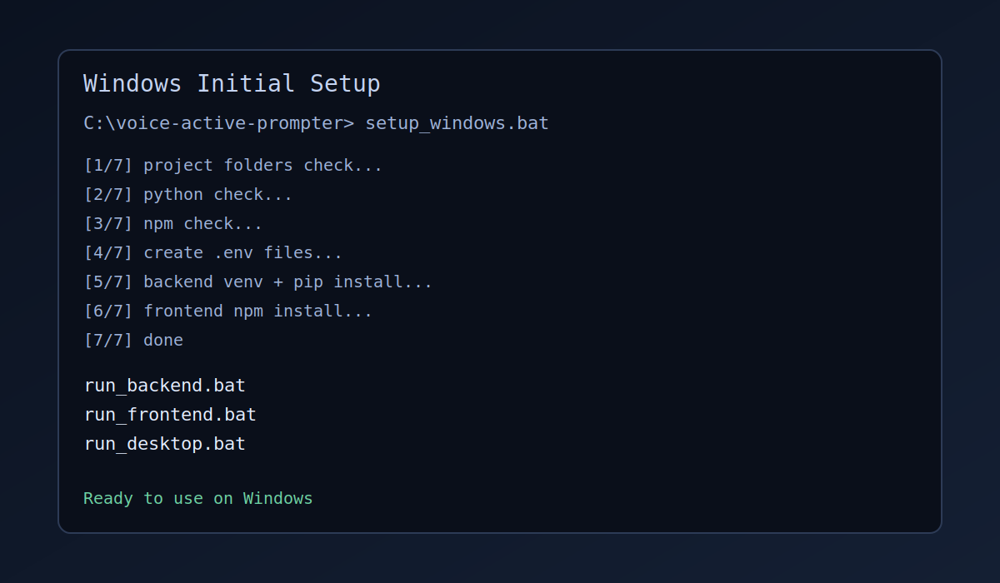
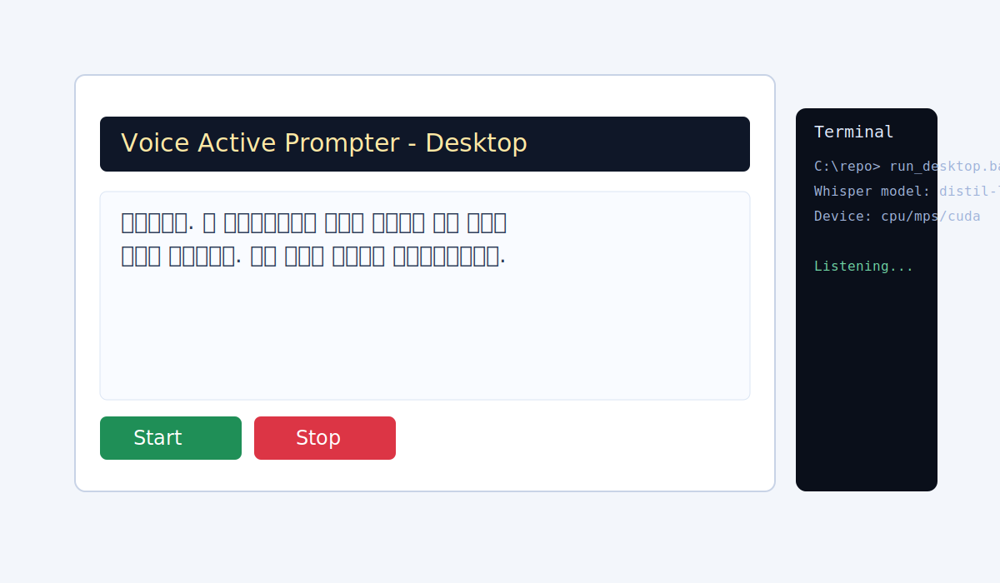

# AI PROMPTER

[](https://github.com/qorbals8165-tech/voice-active-prompter/tags)
[](https://www.python.org/)
[](https://nodejs.org/)
[](https://github.com/qorbals8165-tech/voice-active-prompter)

> 이전 이름은 **Voice Active Prompter** 입니다. 앱 표시 이름은 **AI PROMPTER**로 변경되었습니다.

음성을 실시간으로 인식해 대본 진행 위치를 자동으로 맞춰주는 Whisper 기반 AI 텔레프롬프터입니다.  
OS 레벨 마이크 직접 캡처, 문서(대본) 불러오기, 키워드 점프, 자동 스크롤, 자막 출력, UI 커스터마이징을 지원합니다.

## 1) 프로젝트 소개

AI PROMPTER는 발표자가 마우스 조작 없이 대본을 읽을 수 있게 설계된 데스크톱 중심 프롬프터입니다.

- 실시간 음성 인식 결과를 기준으로 현재 읽는 위치를 추정
- 브라우저 권한 팝업 없이 OS 레벨(PortAudio)에서 마이크를 직접 캡처
- `.txt` / `.md` / `.docx` / `.hwp` 문서를 대본으로 바로 불러오기
- 별도 라이브 자막 출력창 및 프롬프터 반사(미러) 환경용 자막 미러링 지원
- GPU 가능 시 자동 가속, 불가 시 CPU 폴백
- 독립 실행 시 단일 네이티브 창(pywebview)으로 백엔드·UI를 함께 구동

## 2) 주요 기능

- Transformers 기반 Whisper 전사 엔진 (단일 백엔드, 디바이스 cuda/mps/cpu 자동 감지)
- Transformers 한국어 Whisper 모델 지원 (기본 `openai/whisper-small`, 예: `ghost613/whisper-large-v3-turbo-korean`)
- OS 레벨(sounddevice/PortAudio) 마이크 직접 캡처 — 브라우저 `getUserMedia` 권한 팝업 불필요
- 음성 구간 검출(VAD) 기반 저지연 청크 인식 + 중간 전사 + 환각 필터링
- `.txt` / `.md` / `.docx` / `.hwp` 대본 문서 불러오기
- 입력 장치 자동 나열 및 실시간 입력 레벨 미터
- Waveform / Spectrogram / Mel Spectrogram 오디오 디버그 뷰(레거시 데스크톱 모드)
- 대본 자동 동기화 및 진행 하이라이트
- 발표용 라이브 자막 출력창 / 전체화면 발표 모드
- 미러(좌우 반전) 자막 출력
- 키워드 점프, 자동 스크롤
- 폰트 크기/줄 간격/테마/본문 폭 커스터마이징
- 단일 네이티브 창(pywebview) 실행 + 데스크톱 앱 아이콘

## 3) 프로젝트 구조

- `backend/`: FastAPI API + 음성 인식 코어 + 독립 실행 런처
  - `app/main.py`: API 라우트(전사 · 진행 추정 · 인식 제어 · 문서 임포트) 및 프로덕션 정적 서빙
  - `app/core.py`: Transformers Whisper 모델 로딩·전사 코어
  - `app/native_audio.py`: OS 레벨 마이크 캡처 + VAD 기반 실시간 인식 컨트롤러
  - `app/document_import.py`: `.txt/.md/.docx/.hwp` 대본 추출
  - `app/launcher.py`: uvicorn(백그라운드) + pywebview 창 런처
  - `app/desktop.py`: 레거시 Tkinter 데스크톱 모드(`--desktop`)
  - `app/paths.py`: 개발/번들(PyInstaller) 공통 리소스 경로 해석
  - `run_app.py` / `aiprompter.spec`: PyInstaller 진입점·패키징 스펙
- `frontend/`: React + Vite 웹 프롬프터 UI (`public/fonts`에 Paperlogy 폰트 포함)
- `docs/screenshots/`: 설치/실행 스크린샷
- `scripts/`: 아이콘 생성(`render_app_icon.py`) 및 macOS 아이콘/번들 보조 스크립트
- `backend/scripts/`: 한국어 ASR 학습/진단 스크립트(`train_korean_asr.py`)

## 4) 설치 방법

### Windows (권장: 자동 설치)

프로젝트 루트에서 1회 실행:

```bat
setup_windows.bat
```

이 스크립트가 다음을 자동으로 처리합니다.

- Python / npm 존재 확인
- `backend/.env`, `frontend/.env` 자동 생성 (`.env.example` 기준)
- `backend` 가상환경 생성 및 `requirements.txt` 설치
- `frontend` `npm install`

추가 템플릿:

- 로컬 개발용: `backend/.env.local.example`
- 배포용: `backend/.env.prod.example`

### macOS / 수동 설치

```bash
cp backend/.env.example backend/.env
cp frontend/.env.example frontend/.env

cd backend
python -m venv .venv
source .venv/bin/activate
pip install -r requirements.txt

cd ../frontend
npm install
```

## 5) 실행 방법

### Backend API 실행

```bash
cd backend
source .venv/bin/activate
uvicorn app.main:app --reload
```

- 기본 주소: `http://localhost:8000`
- Windows 빠른 실행: `run_backend.bat`

### Desktop 앱 실행

```bash
cd backend
source .venv/bin/activate
python -m app            # 기본: 단일 네이티브 창(pywebview)으로 React UI + 백엔드 동시 실행
python -m app --desktop  # 레거시: Tkinter 텔레프롬프터 + 라이브 자막 창
```

- 기본 모드(`python -m app`)는 내부적으로 uvicorn 백엔드를 띄우고 pywebview 창에 웹 UI를 로드합니다(별도 브라우저 불필요).
- 레거시 `--desktop` 모드는 독립 실행형 텔레프롬프터 창 + 라이브 자막 창을 함께 엽니다.
  - `인식 · 상태` 카드의 `오디오 디버그 창 열기` 버튼으로 입력 진단 창을 띄울 수 있습니다.
  - 기본 입력 민감도는 `180%`로 조정되어, 일반 실내 음성에서 게이트 차단이 덜 발생하도록 튜닝되었습니다.
  - 인식 프리셋(속도/균형/정확도) 적용 시 입력 민감도도 함께 조정되도록 미세튜닝되었습니다.
- Windows 빠른 실행: `run_desktop.bat`

### Frontend 개발 서버 실행

```bash
cd frontend
npm run dev
```

- 기본 주소: `http://localhost:5173`
- Windows 빠른 실행: `run_frontend.bat`

### macOS 앱 번들(더블클릭 실행용) 준비

```bash
./scripts/prepare_macos_app_bundle.sh
```

## 5-1) 배포용 설치 파일 빌드 (다른 PC에 설치)

Python/Node 설치 없이 다른 PC에서 바로 실행할 수 있는 독립 실행 파일을 만듭니다.
PyInstaller로 백엔드·프론트엔드·PyTorch를 하나로 묶습니다. **Whisper 모델(~1.5GB)은
번들에 포함하지 않고 첫 실행 시 인터넷에서 자동으로 내려받아 캐시**합니다(이후 오프라인 동작).

> 크로스 빌드는 불가능합니다 — Windows용은 Windows에서, macOS용은 macOS에서 빌드해야 합니다.

### macOS

```bash
./build_macos.sh
```

- 내부적으로 `frontend` 빌드 후 `pyinstaller aiprompter.spec --noconfirm --clean`을 실행합니다.
- 결과물: `backend/dist/AI PROMPTER.app`
- 배포 시 `.app`을 zip으로 압축하거나 `.dmg`로 만들어 전달합니다.
- 서명되지 않은 앱이라 받는 쪽에서 처음 실행 시 우클릭 → "열기"로 Gatekeeper를 통과해야 합니다.

### Windows

```bat
build_windows.bat
```

- 결과물: `backend\dist\AIPrompter\AIPrompter.exe`
- 배포 시 `dist\AIPrompter` 폴더 전체를 압축해 전달하거나, Inno Setup 등으로
  설치 마법사를 만듭니다.

### 참고

- 첫 실행은 모델 다운로드 때문에 시간이 걸립니다(네트워크 속도에 따라 수 분). 이후엔 빠릅니다.
- 빠른 인식(⚡) 모드만 쓰면 모델 다운로드 없이 즉시 동작합니다(인터넷 필요).
- 빌드 산출물에는 PyTorch가 포함되어 용량이 큽니다(수 GB).

## 6) 환경변수

### `backend/.env`

```dotenv
# 전사 엔진은 Transformers Whisper 단일 백엔드 (디바이스 cuda/mps/cpu 자동 감지)
# 모델 ID — 코드 기본값: openai/whisper-small
# 한국어 정확도를 높이려면 ghost613/whisper-large-v3-turbo-korean 권장(더 느림/큼)
TRANSFORMERS_WHISPER_MODEL_ID=ghost613/whisper-large-v3-turbo-korean

# Comma-separated frontend origins
BACKEND_CORS_ORIGINS=http://localhost:5173,http://127.0.0.1:5173

# Optional API key auth (set non-empty value to require X-API-Key header)
BACKEND_API_KEY=
BACKEND_REQUIRE_API_KEY=false

# Per-IP request budget per minute (in-memory)
BACKEND_RATE_LIMIT_PER_MINUTE=80
BACKEND_RATE_LIMIT_MAX_CLIENTS=10000

# Trust x-forwarded-for for client IP based rate limit (enable only behind trusted proxy)
BACKEND_TRUST_PROXY_HEADERS=false

# Maximum upload payload for /api/transcribe (MB)
BACKEND_MAX_UPLOAD_MB=20

# Expose model/device details on /api/health
BACKEND_EXPOSE_HEALTH_DETAILS=false
```

운영 프로필 권장:

1. 로컬 테스트: `backend/.env.local.example` 기반 (`BACKEND_REQUIRE_API_KEY=false`)
2. 배포 환경: `backend/.env.prod.example` 기반 (`BACKEND_REQUIRE_API_KEY=true`)
3. Windows에서 수동 전환 시:
`copy backend\\.env.local.example backend\\.env`
`copy backend\\.env.prod.example backend\\.env`

### `frontend/.env`

```dotenv
VITE_API_BASE_URL=http://localhost:8000/api
# BACKEND_REQUIRE_API_KEY=true 일 때 설정 (서버의 BACKEND_API_KEY와 동일해야 함)
VITE_API_KEY=
```

## 7) API 개요

- `GET /api/health`: 서비스 상태 (`BACKEND_EXPOSE_HEALTH_DETAILS=true`일 때 모델/디바이스 포함)
- `GET /api/settings/defaults`: UI 기본값 로드
- `POST /api/transcribe`: 오디오 파일 전사
- `POST /api/progress`: 인식 텍스트 기준 대본 진행 위치 추정
- `GET /api/audio-devices`: OS 레벨 입력 장치 목록
- `POST /api/recognition/start` · `POST /api/recognition/stop` · `GET /api/recognition/state` · `POST /api/recognition/script`: 네이티브 마이크 실시간 인식 제어/상태/대본 갱신
- `POST /api/import-document`: `.txt/.md/.docx/.hwp` 문서에서 대본 텍스트 추출

> 프로덕션 빌드에서는 `frontend/dist`가 존재하면 동일한 백엔드 서버가 `/`에서 정적 UI를 함께 서빙합니다.

배포 보안 권장:

- 공개 배포 시 `BACKEND_API_KEY`를 설정하고 요청 헤더 `X-API-Key`를 사용하세요.
- `BACKEND_REQUIRE_API_KEY=true`를 유지해 인증 누락 배포를 방지하세요.
- `BACKEND_RATE_LIMIT_PER_MINUTE`, `BACKEND_RATE_LIMIT_MAX_CLIENTS`, `BACKEND_MAX_UPLOAD_MB`를 운영 환경에 맞춰 조정하세요.
- 다중 인스턴스/로드밸런서 환경에서는 애플리케이션 내부 limiter만으로는 충분하지 않으므로, WAF/Nginx/Cloud LB 레벨 rate limit를 함께 사용하세요.
- `BACKEND_TRUST_PROXY_HEADERS`는 신뢰 가능한 프록시 뒤에서만 `true`로 설정하세요.
- `BACKEND_EXPOSE_HEALTH_DETAILS=false` 유지(기본값)로 런타임 정보 노출을 최소화하세요.

## 8) 스크린샷 & 데모

### 설치 화면 (`setup_windows.bat`)



### 데스크톱 실행 화면 (`run_desktop.bat`)



### 데모 실행 빠른 가이드

1. `setup_windows.bat` 1회 실행
2. `run_desktop.bat` 실행
3. 마이크 선택 후 대본을 읽으면 자동 진행 확인

## 9) Release Notes

### 최근 변경 (Unreleased)

- 앱 표시 이름을 **Voice Active Prompter → AI PROMPTER**로 변경 (번들 `AI PROMPTER.app`, Windows `AIPrompter.exe`)
- PyInstaller 스펙 `vap.spec → aiprompter.spec`로 정리, 빌드 산출물·캐시 경로 갱신
- 기본 실행을 단일 네이티브 창(pywebview) 런처로 전환 (`python -m app`), 레거시 Tkinter는 `--desktop`
- OS 레벨(PortAudio) 마이크 직접 캡처 + VAD 기반 실시간 인식 도입 (`/api/recognition/*`, `/api/audio-devices`)
- `.txt/.md/.docx/.hwp` 대본 문서 불러오기 추가 (`/api/import-document`)
- 전사 백엔드를 **Transformers Whisper 단일화** (faster-whisper / ctranslate2 코드·의존성 제거)
- 불필요 파일·중복 폰트 정리 및 `.gitignore`에 `build/` 추가

### v1.0.0

첫 정식 안정 릴리즈입니다.  
이번 버전은 데스크톱 실사용 흐름과 실시간 음성 인식 정확도/안정성 개선에 초점을 맞췄습니다.

- FastAPI + React + Desktop 통합 실행 흐름 안정화
- 마이크 기반 실시간 전사와 대본 자동 진행 로직 개선
- 발표용 라이브 자막창, 전체화면 모드, 미러(좌우 반전) 모드 제공
- Windows 실행 스크립트(`setup_windows.bat`, `run_*.bat`) 정리
- `.env.example` 기반 초기 설정 절차 표준화
- README 및 스크린샷 문서 보강

## 10) 학습 데이터 진단 (선택)

`train_korean_asr.py` 실행 시 오디오 전처리 점검용 진단 파일을 함께 생성할 수 있습니다.

```bash
cd backend
source .venv/bin/activate
python scripts/train_korean_asr.py \
  --audio-diagnostics \
  --diagnostic-samples-per-split 4 \
  --max-train-samples 512 \
  --max-eval-samples 64
```

생성 위치:

- `training_runs/.../diagnostics/summary.json`
- `training_runs/.../diagnostics/train/sample_XX_spectrogram.png`
- `training_runs/.../diagnostics/train/sample_XX_mel.png`
- `training_runs/.../diagnostics/validation/sample_XX_spectrogram.png`
- `training_runs/.../diagnostics/validation/sample_XX_mel.png`

## 11) 참고

- 첫 실행 시 Whisper 모델 다운로드로 시간이 걸릴 수 있습니다.
- CUDA 감지 시 GPU 가속이 자동 사용됩니다.
- GPU 미탑재 환경에서는 CPU 모드로 자동 전환됩니다.
- 민감정보는 반드시 `.env`에만 두고 Git에 커밋하지 마세요.

## 12) 마이크 단자별 체크리스트 (Windows)

### 1. 3.5mm 마이크 단자 (Mic In, 보통 핑크 / TRS)

1. PC의 `Mic In` 단자에 연결했는지 확인 (헤드폰 출력 단자 X)
2. `설정 > 시스템 > 소리 > 입력`에서 장치가 보이는지 확인
3. 입력 장치 선택 후 말할 때 입력 레벨 반응 확인
4. 앱에서 `새로고침` 후 해당 장치 선택
5. 앱 입력 미터가 움직이지 않으면 Windows 입력 볼륨(게인) 증가

### 2. 3.5mm 헤드셋 콤보 단자 (TRRS)

1. 노트북/PC가 `헤드셋 콤보(TRRS)`를 지원하는지 확인
2. TRS 마이크를 사용할 경우 TRS↔TRRS 변환 젠더 필요 여부 확인
3. Windows에서 “헤드셋 마이크” 입력 장치로 인식되는지 확인
4. 앱에서 해당 장치 선택 후 입력 미터 반응 확인

### 3. 3.5mm 라인 입력 (Line-In, 보통 파랑)

1. `Line-In`은 저레벨 마이크 입력과 감도가 다름을 인지
2. 일반 다이내믹 마이크 직결 시 소리가 매우 작을 수 있음
3. 가능하면 프리앰프/오디오 인터페이스 경유 사용 권장
4. 앱 입력 민감도 상승 + Windows 입력 레벨 조정

### 4. USB 마이크

1. 장치 연결 후 드라이버 자동 설치 완료 확인
2. Windows 기본 입력 장치로 USB 마이크 선택
3. 앱에서 장치 목록 `새로고침` 후 USB 마이크 선택
4. 샘플레이트가 비정상적일 경우 장치 고급 설정에서 16k/48k 확인

### 5. USB 오디오 인터페이스 (XLR/6.35mm 포함)

1. 인터페이스 입력 게인 먼저 조정 (클리핑 LED 확인)
2. 팬텀파워(48V) 필요 마이크는 인터페이스에서 활성화
3. Windows 입력 장치를 오디오 인터페이스로 선택
4. 앱에서 인터페이스 입력 채널 장치 선택
5. 노이즈/지연이 크면 버퍼/샘플레이트 설정 점검

### 6. 블루투스 마이크/헤드셋

1. 연결 프로파일이 `Hands-Free`로 잡히는지 확인
2. 일부 기기에서 음질/지연이 유선 대비 불리할 수 있음
3. 앱 입력 미터가 불안정하면 유선/USB 마이크 우선 권장

### 공통 문제 해결 체크

1. `설정 > 개인정보 및 보안 > 마이크`에서 데스크톱 앱 접근 허용
2. 앱 장치 `새로고침` 후 다시 선택
3. 앱 입력 민감도 조정 (작으면 올리고, 과하면 내리기)
4. 다른 녹음 앱(Windows 음성 녹음기)에서 먼저 입력 동작 확인
